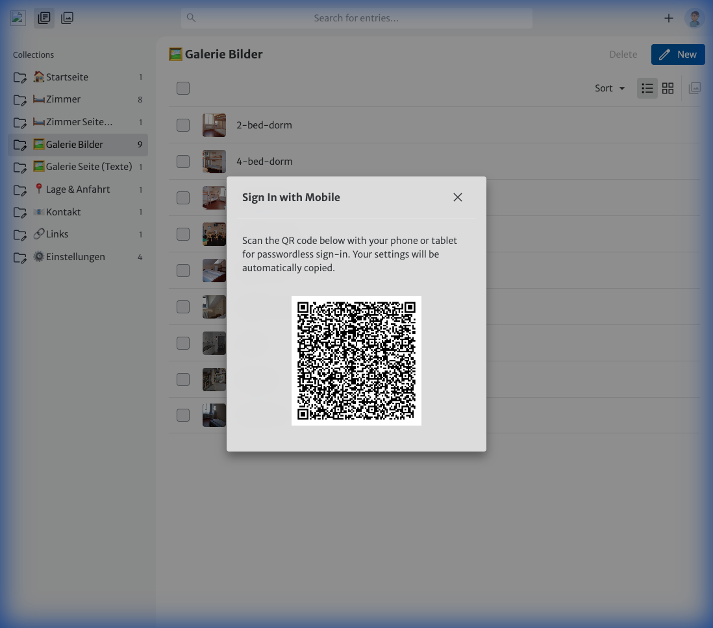
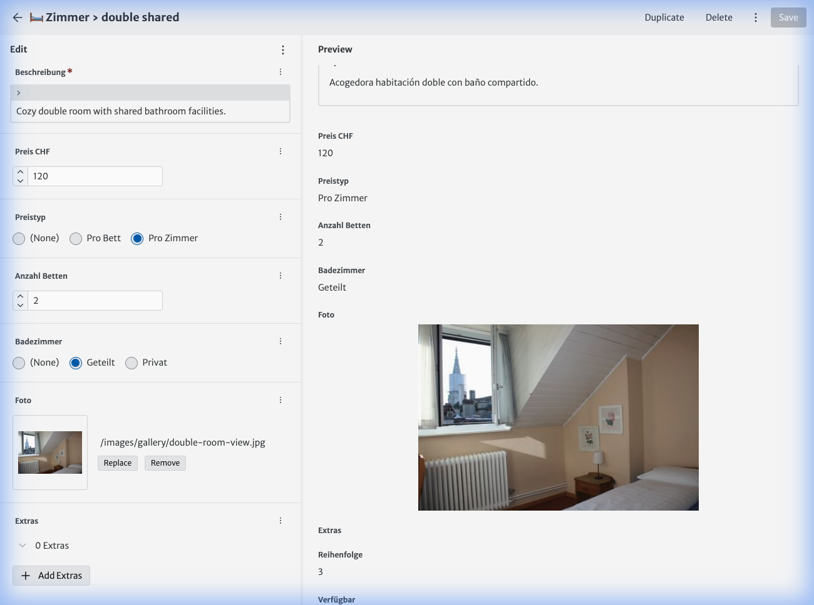
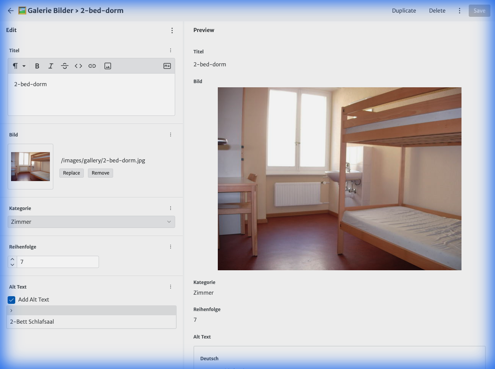
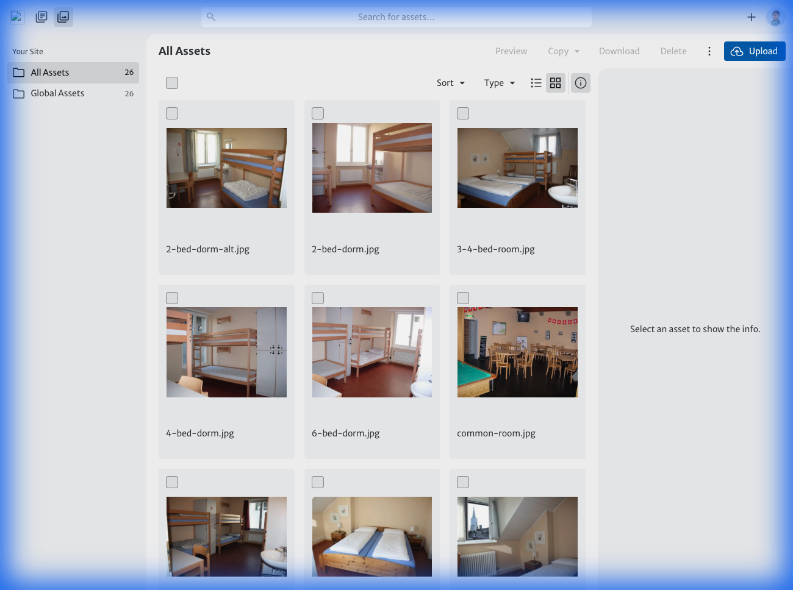
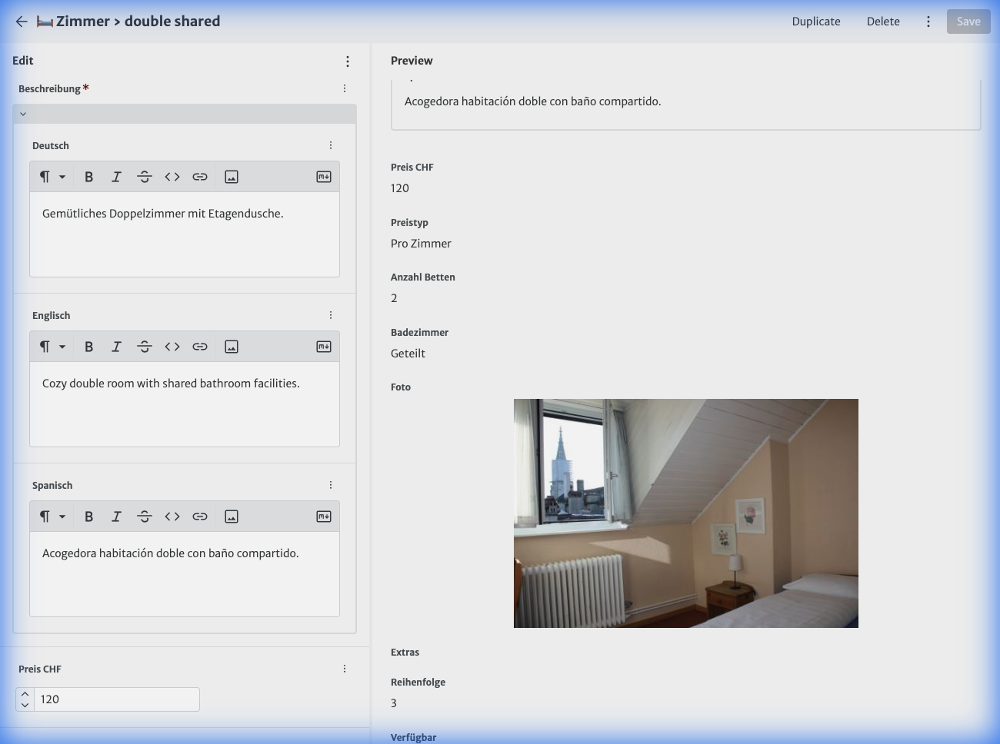

# CMS Handbuch 📘

> [!IMPORTANT]
> **Private Demo-Instanz**: Diese Website läuft derzeit im "Stealth-Modus" (`noindex, nofollow`). Sie ist **nicht auffindbar** bei Google oder anderen Suchmaschinen. Sie können Inhalte hier sicher bearbeiten und testen, ohne öffentlich sichtbare Suchergebnisse zu beeinflussen.

Willkommen beim **Bern Backpackers Content Management System (CMS)**. Dieser Leitfaden ist Ihr komplettes Handbuch zur Verwaltung der Website und bietet detaillierte Anweisungen für jede Seite und Funktion.

## 🚀 Schnellstart

1.  **Einloggen**: Gehen Sie zu `https://curious-fudge-dcd031.netlify.app/admin` und melden Sie sich mit Ihrem GitHub-Konto an.
2.  **Navigieren**: Verwenden Sie die spezifischen "Collections" (Sammlungen) in der linken Seitenleiste, um Inhalte zu finden.
3.  **Bearbeiten**: Klicken Sie auf einen Eintrag, um den Editor zu öffnen.
4.  **Speichern**: Klicken Sie oben auf den **Save** (Speichern) Button, um Änderungen sofort anzuwenden.

*Abbildung 1: Dashboard - Hier finden Sie alle Inhalte*

---

## 🛡️ Sicherheit & "Stressfreies" Bearbeiten

**"Was passiert, wenn zwei Personen dieselbe Seite speichern?"**

Das System verfügt über eine integrierte Sicherheitssperre. Wenn jemand eine Änderung speichert, während Sie dieselbe Seite bearbeiten:
1.  Erkennt das System einen "Konflikt" (Version Mismatch).
2.  Ihr Speichervorgang wird mit einer roten Fehlermeldung blockiert ("Entry changed by another user").
3.  **Es gehen keine Daten verloren.** Sie laden die Seite einfach neu, um die Änderungen der anderen Person zu sehen, und wenden Ihre Änderungen erneut an.

---

## 📖 Seite-für-Seite Dokumentation

### 🏠 Startseite
Diese Sammlung steuert alles auf der Startseite.

*   **Hero Titel/Untertitel**: Der große Begrüßungstext ganz oben.
*   **Badge Text**: Das kleine Highlight-Label über dem Titel.
*   **Button Text (Hero CTA)**: Der Text für den Haupt-Buchungs-Button ("Jetzt buchen").
*   **Vorteile (Features)**:
    *   Liste der wichtigsten Vorteile (z. B. "Mitten in der Stadt").
    *   **Icon**: Wählen Sie ein visuelles Symbol aus der Liste.
*   **Ausstattung (Amenities)**:
    *   Liste der Einrichtungen wie "Gratis WLAN".
    *   **Icon**: Wählen Sie Symbole für die Ausstattungsliste.
*   **CTA Section**: Der letzte "Call to Action"-Block am Ende der Seite.

### 🛏️ Zimmer
Verwalten Sie die tatsächlich verfügbaren Zimmer.

*   **Available (Verfügbar)**: Schalten Sie diesen Schalter auf **OFF**, um ein Zimmer als "Ausgebucht" oder "Nicht verfügbar" zu markieren. Es wird auf der Website ausgegraut angezeigt.
*   **Price & Unit**: Legen Sie den Preis (CHF) fest und ob er "Pro Bett" oder "Pro Zimmer" gilt.
*   **Photo**: Laden Sie das Hauptbild für die Zimmerkarte hoch.
*   **Order**: Zahl für die Sortierung der Zimmer (1 = erstes, 10 = letztes).
*   **Beds & Bath**: Definieren Sie die Kapazität und ob das Bad privat oder geteilt ist.

*Abbildung 2: Zimmer bearbeiten - Verfügbarkeit und Preise*

### 🛏️ Zimmer Seite (Texte)
*   **System Labels**: Bearbeiten Sie die Übersetzungen für statische Texte auf der Zimmerseite, wie z. B.:
    *   Text des "Jetzt buchen"-Buttons.
    *   Labels für "Ausgebucht" / "Booked".
    *   Labels für "Geteiltes Bad".

### 🖼️ Galerie Bilder
Laden Sie visuelle Inhalte für die Galerie-Seite hoch.

*   **Image**: Laden Sie ein hochwertiges Foto hoch (Bilder werden automatisch optimiert).
*   **Category**: **Wichtig für den Filter**. Wählen Sie, wohin dieses Bild gehört:
    *   `Zimmer`
    *   `Einrichtungen`
    *   `Gemeinschaftsräume`
    *   `Aussenbereich`
    *   `Lage`
*   **Order**: Steuert die Reihenfolge der Anzeige.

*Abbildung 4: Galerie Eintrag - Kategorie ist wichtig*

### 🖼️ Galerie Seite (Texte)
*   **Filters**: Übersetzen Sie den Text für die Kategorie-Buttons (z. B. "Gemeinschaftsräume" in "Wohnzimmer" umbenennen).
*   **No Images Message**: Text, der angezeigt wird, wenn eine Kategorie leer ist.

### 🏆 Awards (Auszeichnungen)
Verwalten Sie Ihre Auszeichnungen und Preise.

*   **Page Title**: Die Überschrift, die auf der Seite angezeigt wird.
*   **Awards List**: Fügen Sie einzelne Auszeichnungen hinzu.
    *   **Title**: Name der Auszeichnung (z. B. "TripAdvisor Gewinner").
    *   **Image**: Laden Sie das Abzeichen/Logo hoch.
    *   **Year**: (Optional) Das Jahr der Auszeichnung.

### ⚖️ Rechtliches (Datenschutz & AGB)
Bearbeiten Sie den Inhalt für "Datenschutz" und "AGB" (Allgemeine Geschäftsbedingungen).

*   **Page Title**: Die Hauptüberschrift (z. B. "Datenschutzerklärung").
*   **Content**: Der vollständige Text der Richtlinie.
    *   **Rich Text**: Sie können Überschriften, Listen, **fetten** Text und Links verwenden.
    *   **Bilder**: Sie können Bilder direkt über die Toolbar in den Text einfügen!

### 🔗 Links (Partner)
Verwalten Sie empfohlene Partner und nützliche Links.

*   **Categories**: Gruppieren Sie Links nach Themen (z. B. "Reiseführer", "Events").
    *   **Category Name**: Die Überschrift für die Gruppe.
    *   **Links**: Fügen Sie eine Liste von URL + Name Paaren hinzu.
*   **Partners**: Ein spezieller Bereich für Hauptpartner mit Logos.
    *   **Logo**: Laden Sie das Logo-Bild des Partners hoch.
    *   **Link URL**: Wohin das Logo verlinken soll.

### 📍 Lage (Standort)
*   **Maps URL**: Der Google Maps Embed-Link.
*   **Directions**: Textblöcke für "Mit Tram", "Zu Fuss", "Mit Auto".
*   **SBB Link**: Link zum SBB-Fahrplan.
*   **Landmarks**: Liste von Sehenswürdigkeiten in der Nähe und deren Gehdistanz.

### 📧 Kontakt
*   **Contact Details**: Aktualisieren Sie Telefon, E-Mail und Adresse.
*   **Opening Hours**: Text für die Rezeptionszeiten.
*   **Form Labels**: Übersetzen Sie die spezifischen Felder im Kontaktformular (Name, Betreff, Nachricht).

---

## 🖼️ Medien- & Asset-Verwaltung

Sie können alle Bilder und Dateien in der zentralen **Medienbibliothek** verwalten.

### Zugriff auf die Bibliothek
1.  Öffnen Sie den Reiter **Media** in der Hauptnavigation.
2.  Hier sehen Sie alle hochgeladenen Dateien, die im System gespeichert sind.

*Abbildung 3: Medienbibliothek - Alle Bilder verwalten*

### Funktionen
*   **Upload**: Klicken Sie auf **Upload New**, um Bilder für die spätere Verwendung hochzuladen.
*   **Drag & Drop**: Sie können Bilder direkt von Ihrem Computer in die Bibliothek ziehen.
*   **Suche**: Nutzen Sie die Suchleiste, um bestimmte Dateinamen zu finden.
*   **Löschen**: Wählen Sie ein Bild aus und klicken Sie auf **Delete**, um es zu entfernen.
    *   *Warnung*: Wenn Sie ein Bild löschen, das aktuell auf einer Seite verwendet wird, wird dieses Bild auf der Website nicht mehr angezeigt (Broken Link).

### Best Practices
*   **Dateinamen**: Verwenden Sie beschreibende Namen wie `zimmer-doppel-aussicht.jpg` anstatt `IMG_9923.jpg`. Das hilft der Suchmaschine (SEO) und beim Wiederfinden.
*   **Größe**: Versuchen Sie, web-optimierte Bilder hochzuladen (JPG/WEBP, ca. 200KB - 800KB).

---

## 📝 Tipps zur Bearbeitung

### Mehrsprachige Inhalte
Die meisten Textfelder haben drei Tabs: `Deutsch`, `Englisch`, `Spanisch`.
> **Tipp**: Überprüfen Sie beim Aktualisieren von Texten immer alle drei Tabs, damit keine Sprache vergessen wird!

*Abbildung 5: Mehrsprachigkeit - Vergessen Sie keine Tabs!*

### Markdown Formatierung
Für Beschreibungen können Sie die Symbolleiste verwenden:
*   **B** für Fett (Bold)
*   *I* für Kursiv (Italic)
*   🔗 für Links
*   Listen (Aufzählungszeichen oder Nummeriert)

### Bilder
*   **Upload**: Sie können Bilder per Drag & Drop direkt in die Bildfelder ziehen.
*   **Bibliothek**: Sie können Bilder wiederverwenden, die bereits in andere Bereiche hochgeladen wurden.
